# Dev Critter

[English](README.md) | **한국어**

Dev Critter는 GitHub 프로필 README를 개발자의 **가장 최근 관찰 상태**가 반영되는 작은 공개 작업 공간으로 바꿔준다.

로컬 CLI에서 상태를 변경할 수 있다.

```bash
dev-critter focus
dev-critter break
dev-critter offline
```

현재 상태는 외부에 저장되고 고정된 SVG endpoint를 통해 렌더링되므로, 상태를 변경할 때마다 GitHub 프로필 저장소에 커밋하거나 push할 필요가 **없다**.

```text
로컬 CLI
    ↓
상태 변경 API
    ↓
비공개 상태 저장소
    ↓
동적 SVG
    ↓
GitHub README
```

Dev Critter는 실시간 presence를 주장하기보다, 가장 최근 관찰값과 그 UTC 시각을 함께 보여준다.

```text
status            : FOCUS
last observation  : 07 Aug 2026 · 04:08 UTC
```

상태 카드는 ASCII 생물, 건조한 임상 메모, 상태별 관찰 기록을 포함한 작은 실험체 관찰 로그 스타일로 구성된다.

## 예시

<a href="https://github.com/cyh6327">
  
</a>

README 레이아웃에 맞게 `width` 속성으로 표시 크기를 조절할 수 있다.

실제 사용 예시: [GitHub 프로필](https://github.com/cyh6327)

## 요구사항

- Node.js 24.x 및 npm
- Vercel 계정
- Vercel 프로젝트
- 프로젝트에 연결된 Private Vercel Blob 저장소

Dev Critter는 Blob 접근에 Vercel OIDC 인증을 사용한다.  
별도의 `STATUS_TOKEN`은 로컬 CLI의 상태 변경 요청을 인증하는 데 사용된다.

## 설정

### 1. 의존성 설치

```bash
npm install
```

Vercel CLI는 프로젝트의 개발 의존성으로 설치되므로, 아래 명령은 전역 설치 없이 `npx vercel`을 사용한다.

### 2. 로컬 프로젝트를 Vercel에 연결

```bash
npx vercel link
```

Dev Critter를 호스팅할 Vercel 프로젝트를 선택한다.

### 3. Private Vercel Blob 저장소 생성 및 연결

Vercel에서 **Private Vercel Blob** 저장소를 생성하고 Dev Critter 프로젝트에 연결한다.

Dev Critter는 Blob 접근에 Vercel의 OIDC 기반 인증을 사용한다. 기본 설정에서는 장기 `BLOB_READ_WRITE_TOKEN`이 필요하지 않다.

로컬에서 실행할 때 Vercel은 연결된 프로젝트 환경을 통해 임시 `VERCEL_OIDC_TOKEN`을 제공한다. 이 토큰을 직접 생성하거나 저장소에 커밋하지 않는다.

### 4. 상태 토큰 생성

`POST /api/status`는 별도의 `STATUS_TOKEN`으로 보호되며, 인증된 로컬 CLI만 표시 상태를 변경할 수 있다.

랜덤 토큰 생성:

```bash
node -e "console.log(require('crypto').randomBytes(32).toString('hex'))"
```

생성된 값은 비밀로 유지한다.

### 5. Vercel에 `STATUS_TOKEN` 추가

생성한 토큰을 Production 환경에 추가한다.

```bash
npx vercel env add STATUS_TOKEN production --sensitive
```

로컬 개발용으로는 **같은 값**을 Development 환경에도 추가한다.

```bash
npx vercel env add STATUS_TOKEN development
```

Preview 배포를 사용할 때만 Preview 환경 설정이 필요하다.

설정된 환경변수는 다음 명령으로 확인할 수 있다.

```bash
npx vercel env ls
```

### 6. 로컬 환경 가져오기

Development 환경변수를 내려받는다.

```bash
npx vercel env pull .env.local
```

이 명령은 개발에 필요한 환경값을 포함하는 로컬 `.env.local` 파일을 만든다. 여기에는 Vercel이 관리하는 OIDC 토큰과 설정된 `STATUS_TOKEN`이 포함된다.

CLI는 `STATUS_TOKEN`을 프로세스 환경변수에서 읽으며 `.env.local`을 자동으로 로드하지 않는다. 저장소 안에서 직접 실행할 때는 Node.js를 통해 파일을 로드한다.

```bash
npm run build:cli
node --env-file=.env.local dist/src/cli.js focus
```

`.env.local`은 Git에서 제외해야 한다.

```gitignore
.env.local
```

### 7. Production 배포

프로젝트를 Production 환경에 배포한다.

```bash
npx vercel deploy --prod
```

프로젝트에 할당된 안정적인 Production 도메인을 사용한다. 예:

```text
https://YOUR-PROJECT.vercel.app
```

이 도메인은 로컬 CLI와 GitHub README 카드 양쪽에서 사용된다.

### 8. 로컬 CLI가 자신의 배포 주소를 사용하도록 설정

self-hosting할 경우 `DEV_CRITTER_URL`을 자신의 Production 도메인으로 설정한다.

`.env.local`에 추가:

```env
DEV_CRITTER_URL=https://YOUR-PROJECT.vercel.app
```

그다음 CLI를 빌드하고 실행한다.

```bash
npm run build:cli
node --env-file=.env.local dist/src/cli.js focus
```

CLI는 다음 주소로 상태 변경 요청을 보낸다.

```text
POST https://YOUR-PROJECT.vercel.app/api/status
```

`focus` 대신 `break` 또는 `offline`을 사용할 수 있다.

### 9. `dev-critter`를 어디서나 실행할 수 있게 설정

저장소 안에서 CLI가 정상 동작하는 것을 확인한 뒤, 어느 디렉터리에서든 `dev-critter` 명령을 사용할 수 있도록 빌드하고 링크한다.

```bash
npm run build:cli
npm link
```

`npm link`는 패키지의 CLI 명령을 로컬 npm 설치 환경에 연결한다.

CLI는 프로세스 환경에 `STATUS_TOKEN`과 `DEV_CRITTER_URL`도 필요하다. 운영체제에 맞게 한 번 설정한다.

#### Windows (PowerShell)

현재 Windows 사용자 범위에 환경변수를 저장한다.

```powershell
[Environment]::SetEnvironmentVariable("STATUS_TOKEN", "YOUR_TOKEN", "User")
[Environment]::SetEnvironmentVariable("DEV_CRITTER_URL", "https://YOUR-PROJECT.vercel.app", "User")
```

설정 후 새 터미널을 연다.

#### macOS / Linux

새 터미널 세션에서도 사용할 수 있도록 shell profile에 환경변수를 추가한다.

기본 macOS `zsh`를 사용하는 경우 `~/.zshrc`에 다음 줄을 추가한다.

```bash
export STATUS_TOKEN="YOUR_TOKEN"
export DEV_CRITTER_URL="https://YOUR-PROJECT.vercel.app"
```

그다음 profile을 다시 불러온다.

```bash
source ~/.zshrc
```

Bash를 사용하는 경우 같은 `export` 구문을 환경에 맞는 Bash startup file에 추가한다.

실제 `STATUS_TOKEN` 값이나 비밀값이 포함된 shell profile을 이 저장소에 커밋하지 않는다.

설정이 끝나면 어느 디렉터리에서든 같은 명령을 사용할 수 있다.

```bash
dev-critter focus
dev-critter break
dev-critter offline
```

### 10. GitHub README에 카드 추가

Production SVG endpoint를 GitHub 프로필 README에 임베드한다.

```html

```

상태가 변경되어도 SVG URL은 그대로 유지된다. CLI는 외부에 저장된 상태만 갱신하므로 GitHub 프로필 저장소에는 상태를 바꿀 때마다 새 커밋이 필요하지 않다.

GitHub는 외부 이미지를 캐시할 수 있으므로, 새 상태가 README에 바로 반영되지 않을 수 있다.

### 환경변수

Dev Critter는 다음 인증 경로를 사용한다.

```text
로컬 CLI
    │
    │ STATUS_TOKEN
    ▼
POST /api/status
    │
    │ Vercel OIDC
    ▼
Private Vercel Blob
```

| 변수 | 용도 | 관리 주체 |
|---|---|---|
| `STATUS_TOKEN` | 로컬 CLI의 상태 변경 요청을 인증 | 사용자 |
| `DEV_CRITTER_URL` | CLI가 사용할 API origin. self-hosting 시 자신의 Production 배포 주소로 설정 | 사용자 |
| `VERCEL_OIDC_TOKEN` | Blob 접근 시 Vercel 프로젝트를 인증 | Vercel |

`VERCEL_OIDC_TOKEN`은 임시 값이며 Vercel이 관리한다.  
`.env.local`이나 실제 토큰 값을 저장소에 커밋하지 않는다.
