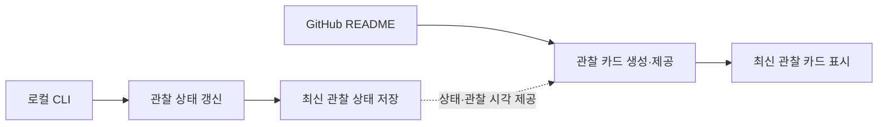

# Project Map

이 문서는 Dev Critter MVP의 주요 기능·책임과 연결 관계를 보여주는 최상위 지도다. 상태 변경과 GitHub README 표시라는 두 진입 흐름이 최신 관찰 상태를 중심으로 연결된다.

## 전체 흐름

## 관리 원칙

- `PROJECT-MAP.md`에는 로컬 상태 변경, 최신 관찰 상태 저장, 관찰 카드 제공처럼 프로젝트의 최상위 책임과 연결 관계만 기록한다.
- MVP에는 `focus`, `break`, `offline`의 장기 상태만 포함하며, GitHub 활동 기반 일시 이벤트는 실제 구현 범위에 들어오기 전까지 지도에 추가하지 않는다.
- 상태별 장면·문구, ASCII 애니메이션, UTC 표시 형식, 캐시 정책, endpoint와 저장소 구현 등은 최상위 구조를 바꾸지 않는 한 이 문서에 기록하지 않는다.
- 현재 MVP의 두 실행 경로는 단순한 직선형 흐름이므로 별도 Flow 문서를 만들지 않는다.
- 여러 단계의 주요 판정, 복잡한 상태 전이, 여러 책임 간 orchestration 등 독립적으로 추적할 가치가 있는 흐름이 생길 때만 `docs/flows/*.md`를 추가한다.
- 주요 책임이나 책임 간 연결 관계가 바뀔 때만 Mermaid를 수정하며, 구현 세부사항만 변경된 경우에는 이 문서를 변경하지 않는다.
